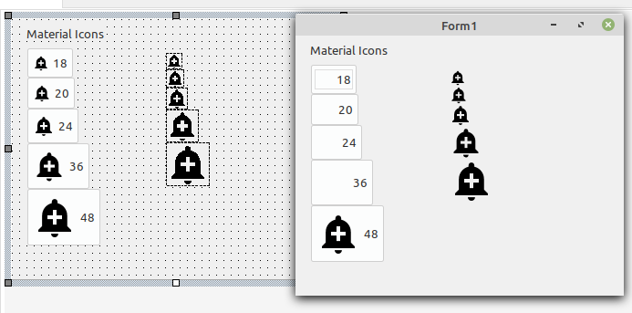
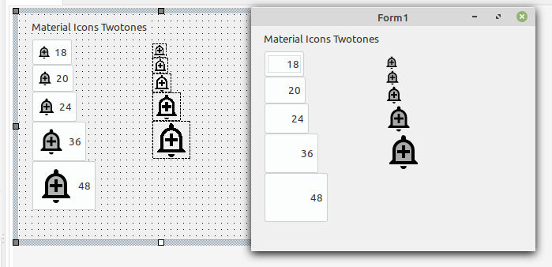

# lazarus-gtk-error

Icons from [GitHub - google/material-design-icons: Material Design icons by Google](https://github.com/google/material-design-icons) (android directory)

android/[alert](https://github.com/google/material-design-icons/tree/master/android/alert)/[add_alert](https://github.com/google/material-design-icons/tree/master/android/alert/add_alert)/[materialicons](https://github.com/google/material-design-icons/tree/master/android/alert/add_alert/materialicons)/[black](https://github.com/google/material-design-icons/tree/master/android/alert/add_alert/materialicons/black)/[res](https://github.com/google/material-design-icons/tree/master/android/alert/add_alert/materialicons/black/res)/**drawable-mdpi**/ 

and

android/[alert](https://github.com/google/material-design-icons/tree/master/android/alert)/[add_alert](https://github.com/google/material-design-icons/tree/master/android/alert/add_alert)/[materialicons](https://github.com/google/material-design-icons/tree/master/android/alert/add_alert/materialicons)/[black](https://github.com/google/material-design-icons/tree/master/android/alert/add_alert/materialicons/black)/[res](https://github.com/google/material-design-icons/tree/master/android/alert/add_alert/materialicons/black/res)/**drawable-mdpi**/

Left is design time and right at runtime

