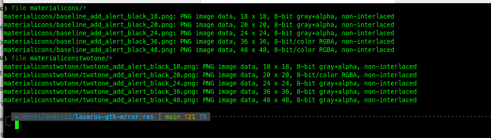

# lazarus-gtk-error

Icones de [GitHub - google/material-design-icons: Material Design icons by Google](https://github.com/google/material-design-icons) (diretório android)

material-design-icons/android/alert/add_alert/materialicons/black/res/drawable-mdpi/

e

material-design-icons/android/alert/add_alert/materialiconstwotone/black/res/drawable-mdpi/

No modo de desenvolvimento, as imagens nos notões (bitbtn) aparecem corretas. Na imagens (TImage) os ícones de duas tonalidades aparecem vazados. Na execução do programa, apenas o botão com a imagem de 40x40 pixel está correto. As imagens de duas tonalidades não aparecem em nenhum botão. As imagens aparecem corretas.

Os três primeiros ícones são escala de cinza + transparência e os dois últimos BGRA (cor + transparência). Se estivessem relacionados, a imagem nos dois últimos botões deveriam aparecer mas só aparece no último. 

Já nas imagens de duas tonalidades, apenas a segunda é RGBA mas nenhuma aparece.